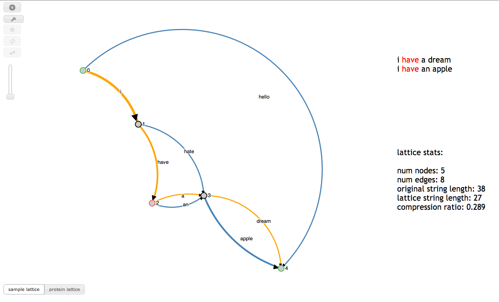

## Visualization of Lattice Structure

Shengjie Wang (wangsj@uw.edu)

Lattice is a special form of graph with a start node and a terminal node, and data are encoded on the paths from the start to the terminal. The key feature of lattice is common edges, which are the edges shared by multiple data-encoding paths. Lattice is widely used in the fields of speech recognition, natural language processing and bioinformatics, as common edges can be applied to compress data, to speed-up algorithms, and to discover common structures within the data. In this paper, we focus on visualization of the lattice structure, with emphasis on the common edges. In particular, we aim to build a system, which takes any lattice as input, displays the lattice structure effectively, and supports various interactions for users to either explore or edit the lattice. With such system, we wish to gain some intuition about how to build the optimal lattice from raw data, which is still an unsolved problem.

[Poster](https://github.com/CSE512-14W/fp-wangsj/raw/gh-pages/final/poster-wangsj.pdf),
[Final Paper](https://github.com/CSE512-14W/fp-wangsj/raw/gh-pages/final/paper-wangsj.pdf)

## Running Instructions

This project is web based. Access our visualization at http://cse512-14w.github.io/fp-wangsj/vis.html or download this repository and run `python -m SimpleHTTPServer 9000` and access this from http://localhost:9000/.

## Short Notes about Using our System
The first button in the tool box (on top left) is an undo button. The second button in the tool box is a toggle button to change between the exploration mode and editing mode.

## Work Breakdown

This project is done individually.

## Development Process

